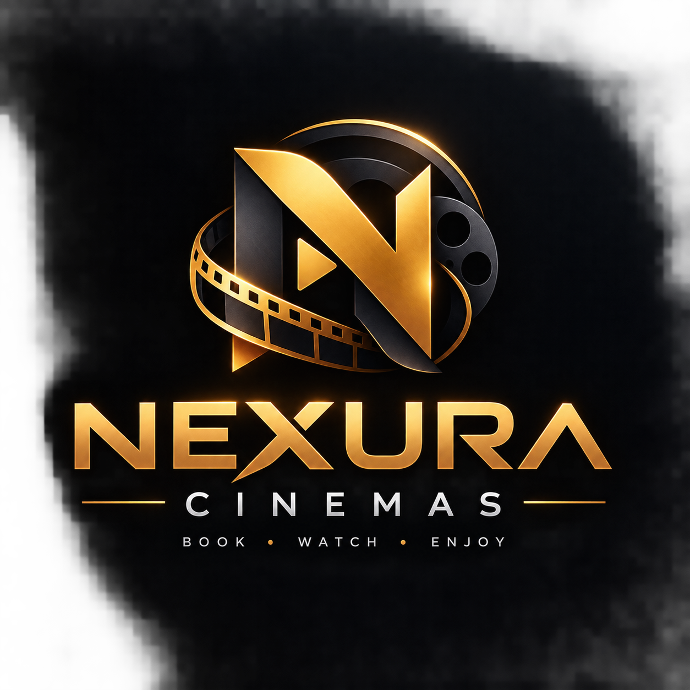

<p align="center">
  
</p>

<h1 align="center">🎬 NEXURA CINEMAS</h1>

<p align="center">
  <strong>Next-Generation Luxury Cinema Ticket Reservation & Concierge Platform</strong>
</p>

<p align="center">
  <a href="#-key-features"></a>
  <a href="#-key-features"></a>
  <a href="#-key-features"></a>
  <a href="#-key-features"></a>
  <a href="#-key-features"></a>
  <a href="#-license"></a>
</p>

<p align="center">
  <a href="#-overview">Overview</a> •
  <a href="#-key-features">Key Features</a> •
  <a href="#-tech-stack">Tech Stack</a> •
  <a href="#-project-structure">Project Structure</a> •
  <a href="#-getting-started">Getting Started</a> •
  <a href="#-environment-variables">Configuration</a> •
  <a href="#-user-booking-flow">Booking Flow</a> •
  <a href="#-admin-operations">Admin Portal</a>
</p>

---

## 🌟 Overview

**Nexura Cinemas** is a premier, full-featured web platform engineered to deliver an unmatched cinema ticketing experience. Designed with an ultra-sleek cinema dark aesthetic, glassmorphic UI elements, radiant neon accents, and fluid responsive interactions, Nexura bridges movie lovers with modern cinema technologies including **IMAX 3D**, **Dolby Atmos**, **4DX**, and **VIP Recliner Lounges**.

The application features real-time seat reservation with curved screen geometry, gourmet concessions pre-ordering, integrated mock payment gateways (PayHere), QR-code admission passes with live gate scanner validation, and an intelligent **AI Cinema Concierge** powered by Groq LLaMA models.

---

## ✨ Key Features

### 🎞️ Customer Cinema Experience
- **Cinematic Billboard & Hero Showcase**: Immersive featured film hero banners, high-definition trailer modal player, ratings, genres, and release tags.
- **Dynamic Movie Catalog & Filter Engine**: Instant search, language filters (*English, Sinhala, Tamil, Hindi*), genre selection, and experience-based classification (*IMAX, Dolby Atmos, VIP, 4DX*).
- **Curved Screen Seat Selection**:
  - Interactive cinema hall seating map with realistic screen curvature and ambient back-glow.
  - Multi-tier seat categories: **Standard**, **VIP Luxury Recliner**, **Couple Pods**, and **Wheelchair Accessible**.
  - Dynamic price computation, 8-minute reservation hold timer, and visual occupied/reserved seat states.
- **Gourmet Concessions & Snack Bar**: Pre-order caramelized popcorn, artisan nachos, signature sliders, cold brews, and combo bundles before arriving at the theater.
- **Secure Multi-Channel Checkout**:
  - Credit/Debit card simulator with live formatting and validation.
  - PayHere digital gateway simulation.
  - Promo code discounts with real-time coupon verification (`NEXURA10`, `VIP25`).
- **Instant Digital Ticket Admission Pass**:
  - Animated ticket pass generation upon confirmation with celebratory confetti effects (`canvas-confetti`).
  - High-resolution SVG/Canvas QR Code generation (`qrcode.react`) for swift turnstile gate check-in.
  - Offline ticket printing and admission pass download.
- **Personalized Watchlist & Customer Profiles**: Save upcoming blockbusters, track reservation histories, view active tickets, and manage user preferences.

### 🤖 AI Cinema Concierge
- Floating assistant integrated on every customer page.
- Powered by high-speed Groq LLaMA inference with resilient fallback offline intelligence.
- Answers queries regarding screening times, movie synopses, popcorn combos, auditorium technologies, and booking assistance in real time.

### 🛡️ Cinema Manager & Admin Portal
- **Real-Time KPI Analytics**: Total box office revenue, seats reserved today, active showtime count, and occupancy rates.
- **Gate Admission QR Scanner**: Simulated live optical scanner validating ticket reference codes against the booking database with audio/visual verification.
- **Film & Showtime Management**: Add new film titles, configure screen allocations, adjust showtime schedules, and set ticket pricing.
- **Concessions Inventory**: Monitor snack inventory levels and update pricing on the fly.

---

## 🛠️ Tech Stack

| Technology | Purpose |
|---|---|
| **[React 19](https://react.dev/)** | Modern UI library with concurrent rendering and hooks |
| **[TypeScript](https://www.typescriptlang.org/)** | Strict type safety, clean interfaces, and developer productivity |
| **[Vite 8](https://vite.dev/)** | Blazing-fast frontend tooling and optimized production bundler |
| **[Tailwind CSS v4](https://tailwindcss.com/)** | Cutting-edge utility-first styling with custom glassmorphism & gradients |
| **[React Router DOM v7](https://reactrouter.com/)** | Declarative client-side routing and nested layout navigation |
| **[Lucide React](https://lucide.dev/)** | Crisp, consistent iconography across all cinema interfaces |
| **[Axios](https://axios-http.com/)** | Robust HTTP client with authentication interceptors and error handling |
| **[React Hot Toast](https://react-hot-toast.com/)** | Sleek glassmorphic notification alerts |
| **[QRCode.react](https://github.com/zpao/qrcode.react)** | Dynamic QR Code generation for contact-free ticket scanning |
| **[Canvas Confetti](https://github.com/catdad/canvas-confetti)** | Physics-based celebration confetti for successful reservations |

---

## 📁 Project Structure

```text
nexura-cinemas-frontend/
├── public/
│   ├── favicon.svg             # Cinema application favicon
│   └── icons.svg               # SVG asset icons
├── src/
│   ├── assets/
│   │   ├── nexura_logo.png     # Official Nexura Cinemas logo branding
│   │   └── hero.png            # Cinematic showcase hero graphics
│   ├── components/
│   │   ├── AdminNavbar.tsx     # Specialized control bar for cinema managers
│   │   ├── AiChatWidget.tsx    # Groq LLaMA AI Cinema Concierge assistant
│   │   ├── AuthModal.tsx       # Glassmorphism login & register dialog
│   │   ├── Footer.tsx          # Cinematic footer with quick links & social icons
│   │   ├── MovieCard.tsx       # Reusable movie card with trailer button & tags
│   │   ├── Navbar.tsx          # Sticky glassmorphic customer navigation
│   │   └── TrailerModal.tsx    # Responsive embedded YouTube trailer player
│   ├── context/
│   │   ├── AuthContext.tsx     # User authentication state & mock login/logout
│   │   └── BookingContext.tsx  # Global booking workflow, selected seats & snacks
│   ├── pages/
│   │   ├── AboutPage.tsx       # Nexura story, brand mission, and VIP cinema tour
│   │   ├── AdminDashboard.tsx  # Cinema staff portal, gate scanner & revenue KPIs
│   │   ├── CheckoutPage.tsx    # Payment simulation, coupon codes & order review
│   │   ├── ConcessionsPage.tsx # Popcorn, beverages & snack pre-order catalog
│   │   ├── ExperiencesPage.tsx # IMAX 3D, Dolby Atmos, 4DX & VIP Lounge showcases
│   │   ├── Home.tsx            # Billboard showcase, movie list & experiences grid
│   │   ├── MovieDetails.tsx    # Cast, synopses, trailers, dates & showtime picker
│   │   ├── MyBookings.tsx      # Customer ticket vault and active admission passes
│   │   ├── ProfilePage.tsx     # User account management & preferences
│   │   ├── SeatSelection.tsx   # Interactive curved cinema hall seat reservation
│   │   ├── TheatresPage.tsx    # Cinema auditorium locations & hall details
│   │   ├── TicketSuccess.tsx   # Confirmed booking pass with scannable QR admission
│   │   └── WatchlistPage.tsx   # Saved films and release reminders
│   ├── services/
│   │   └── api.ts              # API layer, Axios interceptors & realistic mock database
│   ├── types/
│   │   └── index.ts            # TypeScript interfaces (Movie, Booking, ShowTime, etc.)
│   ├── utils/
│   │   └── imageFallback.ts    # High-res Unsplash fallbacks for posters & snacks
│   ├── App.css
│   ├── App.tsx                 # Core application routes & providers layout
│   ├── index.css               # Design system tokens, glassmorphism & glow effects
│   ├── main.tsx                # React DOM root entrypoint
│   └── vite-env.d.ts           # Vite client environment declarations
├── eslint.config.js            # ESLint rules for TypeScript & React
├── index.html                  # HTML5 template with Google Fonts (Plus Jakarta Sans)
├── package.json                # Project dependencies and run scripts
├── tsconfig.json               # TypeScript compiler configuration
├── vite.config.ts              # Vite configuration with Tailwind CSS & React plugins
└── README.md                   # Comprehensive project documentation
```

---

## 🚀 Getting Started

Follow these steps to run Nexura Cinemas locally on your machine:

### 1. Prerequisites
- **Node.js** (v18.0.0 or higher recommended)
- **npm** or **yarn** / **pnpm**
- Modern web browser (Chrome, Firefox, Safari, Edge)

### 2. Clone the Repository
```bash
git clone https://github.com/chathunga2007/Nexura-Cinemas-Booking-System-Frontend.git
cd Nexura-Cinemas-Booking-System-Frontend
```

### 3. Install Dependencies
```bash
npm install
```

### 4. Configure Environment (Optional)
Create a `.env` file in the root directory if you wish to configure a custom backend endpoint or Groq API token:
```env
# Optional Backend API URL (defaults to '/api' with resilient built-in mock database)
VITE_API_BASE_URL=http://localhost:8080/api

# Optional Groq AI API Key for live AI Concierge chat
VITE_GROQ_API_KEY=your_groq_api_key_here
```

### 5. Launch Development Server
```bash
npm run dev
```
Navigate to `http://localhost:5173` in your browser.

### 6. Build for Production
To create an optimized, minified production distribution:
```bash
npm run build
```
Preview the production build locally:
```bash
npm run preview
```

---

## 🎟️ User Booking Flow

```text
[ Home / Movie Catalog ]
          │
          ▼
[ Movie Details & Showtime Selection ]
          │
          ▼
[ Interactive Curved Seat Selection ]
  • Standard, VIP Recliner, Couple Pods
  • 8-Minute Hold Timer
          │
          ▼
[ Gourmet Concessions & Add-Ons ]
  • Caramel Popcorn, Nachos, Artisan Combos
          │
          ▼
[ Checkout & Payment Gateway ]
  • Promo Codes (NEXURA10, VIP25)
  • Card / PayHere Simulation
          │
          ▼
[ Ticket Confirmation & Admission QR ]
  • Confetti Animation
  • Dynamic QR Code Pass
  • Print / Save Ticket
          │
          ▼
[ Gate Admission Scanner ]
  • Staff scans QR Code -> Admission Granted
```

---

## 🛡️ Admin Operations

To access the Cinema Staff & Management Portal:
1. Navigate to `/admin` or click the **Manager Portal** link in the navigation bar.
2. Features available in the Admin Portal:
   - **Ticket Gate Scanner**: Test reference verification (e.g. `NXR-98124`, `NXR-77412`).
   - **Revenue Analytics**: Real-time gross income, ticket volume, and seat occupancy figures.
   - **Movie Catalog Manager**: Add, edit, or archive movies.
   - **Hall Seating Layout Viewer**: Monitor live hall capacities and seat tiers.

---

## 🎨 Design System

Nexura Cinemas employs a tailored cinematic design language:
- **Base Background**: `#090A0F` (Deep Cosmic Obsidian)
- **Primary Accent**: `#F43F5E` (Vibrant Cinema Rose)
- **Secondary Accent**: `#F59E0B` (Amber Gold VIP Luxury)
- **Experience Cyan**: `#06B6D4` (IMAX Neon Cyan)
- **Glassmorphism**: Multi-layered backdrop blurs (`backdrop-blur-xl`), micro-borders (`border-white/10`), and radiant neon backdrops.
- **Typography**: Google Fonts [*Plus Jakarta Sans*](https://fonts.google.com/specimen/Plus+Jakarta+Sans) and [*Outfit*](https://fonts.google.com/specimen/Outfit).

---

## 🤝 Contributing

Contributions, feedback, and suggestions are warmly welcomed!
1. Fork the Project.
2. Create your Feature Branch (`git checkout -b feature/AmazingFeature`).
3. Commit your Changes (`git commit -m "Add AmazingFeature"`).
4. Push to the Branch (`git push origin feature/AmazingFeature`).
5. Open a Pull Request.

---

## 📄 License

Distributed under the **MIT License**. See `LICENSE` for more information.

---

<p align="center">
  Crafted with passion for cinema lovers by <strong>Chathunga Bimsara</strong> 🍿✨
</p>
